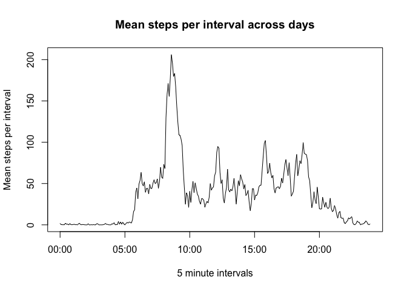
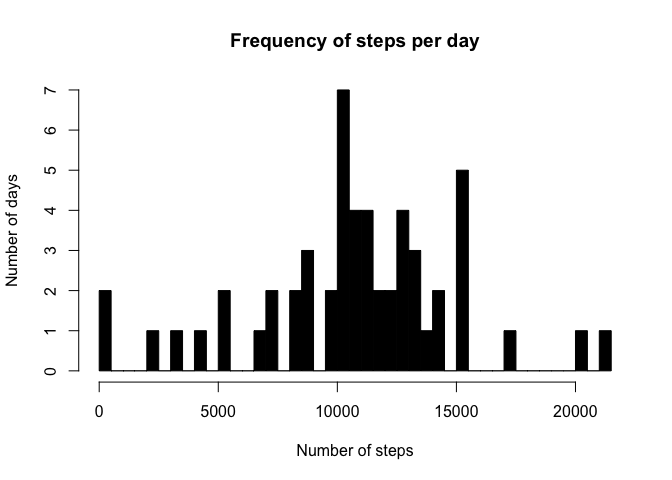
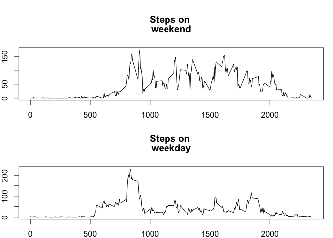

# Reproducible Research: Peer Assessment 1

This assignment makes use of data from a personal activity monitoring device. This device collects data at 5 minute intervals through out the day. The data consists of two months of data from an anonymous individual collected during the months of October and November, 2012 and include the number of steps taken in 5 minute intervals each day.

##Data
The data is preprocessed, and appears clean.
The variables included in this dataset are:

* steps: Number of steps taking in a 5-minute interval (missing values are coded as NA)
* date: The date on which the measurement was taken in YYYY-MM-DD format
* interval: Identifier for the 5-minute interval in which measurement was taken

The dataset is stored in a comma-separated-value (CSV) file and there are a total of 17,568 observations in this dataset.

The data can be found in the [activity.zip file on GitHub](https://github.com/gregrgay/RepData_PeerAssessment1/blob/master/activity.zip) 

## Loading and preprocessing the data

### 1. Load the data 
Check to see if the data is already loaded, and if not read the `activity.csv` file into a data.table variable called `activity`.


```r
if(!exists("activity")){
    activity<-read.csv("activity.csv")
}
```

### 2. Process/transform the data (if necessary) into a format suitable for your analysis
Data appears to be clean, apart from the missing values that are ignored in this part of the assignment

## What is mean total number of steps taken per day?

### 1. Calculate the total number of steps taken per day
First aggregate the sum of steps by date from the activity data and assign to `total_steps_daily`.


```r
total_steps_daily <- aggregate(steps ~ date, activity, sum)
```

The head output from `total_steps_daily`


```r
head(total_steps_daily)
```

```
##         date steps
## 1 2012-10-02   126
## 2 2012-10-03 11352
## 3 2012-10-04 12116
## 4 2012-10-05 13294
## 5 2012-10-06 15420
## 6 2012-10-07 11015
```

### 2. Make a histogram of the total number of steps taken each day
Create a histogram showing the frequency of steps taken per day. 

```r
bin = nrow(total_steps_daily) # the number of days, to be
                              # assigned as the number
                              # of breaks to make the 
                              # distribution more informative 
hist(total_steps_daily$steps, breaks=bin, col=1, freq=TRUE,  main="Frequency of steps per day", xlab="Number of steps", ylab="Number of days")
```

 
The number of days sampled above was 53. One day was had missing data and was dropped from the full 54 day during which the sample was collected.


```r
print(bin)
```

```
## [1] 53
```

###3. Calculate and report the mean and median of the total number of steps taken per day
The mean number of steps taken per day for the unimputed data is `10766.19`:


```r
mean(total_steps_daily$steps, na.rm = TRUE) 
```

```
## [1] 10766.19
```

The median number of steps taken per day for the unimputed data is `10765`:

```r
median(total_steps_daily$steps, na.rm = TRUE) 
```

```
## [1] 10765
```


## What is the average daily activity pattern?
### 1. Make a time series plot (i.e. type = "l") of the 5-minute interval (x-axis) and the average number of steps taken, averaged across all days (y-axis)


```r
# calculate the mean number of steps per interval as a numeric vector
mean_steps <- tapply(activity$steps, activity$interval, mean, na.rm = TRUE)
# calculate the x values and format as time of day
intervals <- strptime(sprintf("%04d", as.numeric(names(mean_steps)) ),format="%H%M")
# plot the mean number of steps per day
plot(intervals, 
     mean_steps, 
     type="l", 
     main="Mean steps per interval across days", 
     xlab="5 minute intervals", 
     ylab="Mean steps per interval")
```

 


### 2. Which 5-minute interval, on average across all the days in the dataset, contains the maximum number of steps?
The `104th 5 minute interval` (8:35 am), averaged across all days, contains the greatest number of steps

```r
max_steps<-which.max(mean_steps)
max_steps
```

```
## 835 
## 104
```
 The value at interval 104/8:35 is 206 steps

```r
round(max(mean_steps)) 
```

```
## [1] 206
```

### 3. Calculate and report the mean and median of the total number of steps taken per day
The mean steps per day for unimputed data is `10766.19`

```r
mean(total_steps_daily$steps, na.rm = TRUE) 
```

```
## [1] 10766.19
```
The median steps per day for unimputed data is `10765`

```r
median(total_steps_daily$steps, na.rm = TRUE) 
```

```
## [1] 10765
```

## Imputing missing values
Note that there are a number of days/intervals where there are missing values (coded as NA). The presence of missing days may introduce bias into some calculations or summaries of the data.

### 1. Calculate and report the total number of missing values in the dataset (i.e. the total number of rows with NAs)

The total number of missing values is `2304`. Create a factor vector of complete cases, and get the elements that return FALSE


```r
originalValue <- complete.cases(activity)  
missingValues <- length(originalValue[originalValue==FALSE])  # number of records with NA  
missingValues
```

```
## [1] 2304
```

### 2. Devise a strategy for filling in all of the missing values in the dataset. The strategy does not need to be sophisticated. For example, you could use the mean/median for that day, or the mean for that 5-minute interval, etc.

Strategy, replace the missing values NA, with the mean for that interval across all days


```r
activity2 <- activity                       # copy original df into a new one
for (i in 1:nrow(activity2)){               # loop through the new df
    if (is.na(activity2$steps[i])){         # if a value is missing (NA)
        activity2$steps[i] <- mean_steps[i] # replace it with the value previously
                                            # calculated in mean_steps for the given
    }                                       # interval
}
head(activity2)
```

```
##       steps       date interval
## 1 1.7169811 2012-10-01        0
## 2 0.3396226 2012-10-01        5
## 3 0.1320755 2012-10-01       10
## 4 0.1509434 2012-10-01       15
## 5 0.0754717 2012-10-01       20
## 6 2.0943396 2012-10-01       25
```


### 3. Create a new dataset that is equal to the original dataset but with the missing data filled in.
already did above in activity2

### 4. Make a histogram of the total number of steps taken each day and Calculate and report the mean and median total number of steps taken per day. Do these values differ from the estimates from the first part of the assignment? What is the impact of imputing missing data on the estimates of the total daily number of steps?
By imputing the missing data with the mean for a given period in a day, no significant difference is present between imputed and non-imputed means, and only a slight difference in present between the imputed and non-imputed median.


```r
total_steps_daily2 <- aggregate(steps ~ date, activity2, sum)
head(total_steps_daily2)
```

```
##         date    steps
## 1 2012-10-01 10766.19
## 2 2012-10-02   126.00
## 3 2012-10-03 11352.00
## 4 2012-10-04 12116.00
## 5 2012-10-05 13294.00
## 6 2012-10-06 15420.00
```

Create a histogram showing the frequency of steps taken per day. 

```r
bin = nrow(total_steps_daily2) # the number of days, to be
                              # assigned as the number
                              # of breaks to make the 
                              # distribution more informative 
hist(total_steps_daily2$steps, breaks=bin, col=1, freq=TRUE,  main="Frequency of steps per day", xlab="Number of steps", ylab="Number of days")
```

 

The number of days sampled above was 54. 

```r
print(bin)
```

```
## [1] 54
```


Comparing the mean steps daily for imputed and non-imputed data, both are equal at and average of 10766.19 steps per day.

```r
mean(strtoi(total_steps_daily2$steps), na.rm = TRUE) # 10766.19
```

```
## [1] 10766.19
```
Comparing the median steps daily for imputed and non-imputed data, a very slight difference exists with 10765 steps per day for non-imputed, and 10765.59 steps per day for the imputed data.

```r
median(total_steps_daily2$steps, na.rm = TRUE) # 10765
```

```
## [1] 10765.59
```

## Are there differences in activity patterns between weekdays and weekends?
There are differences in the number of steps taken on weekdays vs weekends. Overall weekdays have less steps per interval during the day, perhaps attributed to sitting at work. There is a spike between 8am and 9am, which may indicate the subject walks to work. Weekend steps also tend to start later, perhaps indicating the subject sleeps in on the weekend.

### 1. Create a new factor variable in the dataset with two levels – “weekday” and “weekend” indicating whether a given date is a weekday or weekend day.
Using the weekdays() function determine if a day is a Satturday or Sunday, and if so add "weekend" to a new factor variable "daytype", otherwise assign "weekday" to the variable.

```r
daytype <- function(date) {
    if (weekdays(as.Date(date)) %in% c("Saturday", "Sunday")) {
        "weekend"
    } else {
        "weekday"
    }
}
activity2$daytype <- as.factor(sapply(activity2$date, daytype))
head(activity2)
```

```
##       steps       date interval daytype
## 1 1.7169811 2012-10-01        0 weekday
## 2 0.3396226 2012-10-01        5 weekday
## 3 0.1320755 2012-10-01       10 weekday
## 4 0.1509434 2012-10-01       15 weekday
## 5 0.0754717 2012-10-01       20 weekday
## 6 2.0943396 2012-10-01       25 weekday
```

### 2. Make a panel plot containing a time series plot (i.e. type = "l") of the 5-minute interval (x-axis) and the average number of steps taken, averaged across all weekday days or weekend days (y-axis). See the README file in the GitHub repository to see an example of what this plot should look like using simulated data.
Using the base plot system in R, create a 2 row by 1 column panel. Create a timeseries plot for weekends in the top area of the panel, and weekdays in the lower area of the panel.

```r
par(mfrow = c(2, 1), mai=c(0.4,0.4,1.0,0.2))
for (type in c("weekend", "weekday")) {
    day.type <- aggregate(steps ~ interval, data = activity2, subset = activity2$daytype == 
                                type, FUN = mean)
    plot(day.type, type = "l", main = c("Steps on ", type))
}
```

 


